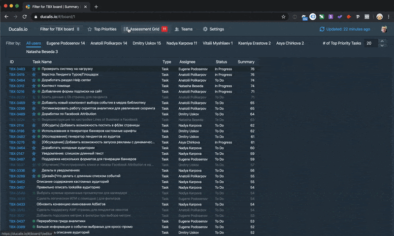

# Роадмап и приоритизация задач

Задача продакт оунера приоритизировать задачи в статусах Инициация и Анализ.

Для приоритизации следует обратится к готовым фреймворкам, напирмер: AARRR или HEART.

Если эти фремворки нам не подходят, то можно придумать свой основываясь на следующих вопросах:

- На какую метрику бизнеса влияет фича?

- Что будет считаться показателем успеха внедрения?

- Сколько людей будет этим пользоваться? Как часто?

- Поможет ли это привлечь новых пользователей?

- Станет ли пользователь счастливее?

- Создаст ли новые источники дохода?

- Если фича окажется успешной — хватит ли у нас ресурсов на ее поддержку и развитие? Производственный цикл станет сложнее, увеличится нагрузка на тех. поддержку и т. д.

- Cколько будет стоить разработка?

- Как быстро мы сможем ее сделать?

- Будет ли это важно и актуально спустя какое-то время?

Эти метрики мы закинем в дукалис ДОПИСАТЬ

