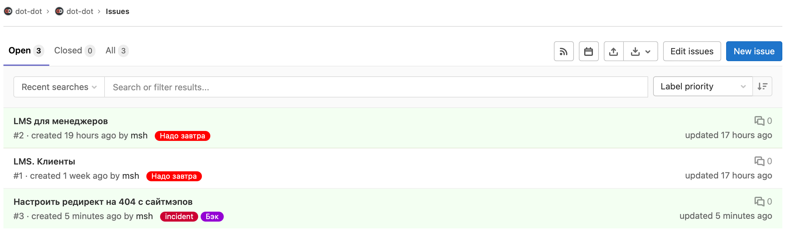

# Роадмап и приоритизация задач

Задача продакт оунера приоритизировать задачи в статусах Инициация и Анализ.

Для приоритизации следует обратится к готовым фреймворкам, напирмер: AARRR или HEART.

Если эти фремворки нам не подходят, то можно придумать свой основываясь на следующих вопросах:

- На какую метрику бизнеса влияет фича?

- Что будет считаться показателем успеха внедрения?

- Сколько людей будет этим пользоваться? Как часто?

- Поможет ли это привлечь новых пользователей?

- Станет ли пользователь счастливее?

- Создаст ли новые источники дохода?

- Если фича окажется успешной — хватит ли у нас ресурсов на ее поддержку и развитие? Производственный цикл станет сложнее, увеличится нагрузка на тех. поддержку и т. д.

- Cколько будет стоить разработка?

- Как быстро мы сможем ее сделать?

- Будет ли это важно и актуально спустя какое-то время?

Оценивать задачи предлагается по пятибалльной шкале, где:
- 1 — «точно нет», «легко», «мало», «быстро», «дешево»
- 5 — «точно да», «трудно», «много», «медленно», «дорого».

Бизнесовую часть задачи оценивает «бизнес»: генеральный директор, операционный директор, директор по маркетингу, PO, CTO, дизайнер, PM. 

Техническую часть задач оценивает «разработка»: бэкенд, фронттенд-разработчики, тестировщики.

Сбор метрик реализуется через стороннее приложение ducalis.io. В свою очередь, Дукалис интегрируется с Гитлаб и возвращает суммарную оценку для PO, помогая ему принимать решения.

PO актуализирует приоритеты для всех команд:
- сайт,
- мобильное приложение,
- интеграции.

Приоритизация происходит в Гитлабе в разделе Issue → List. Такие разделы есть у каждой команды.

PO может игнорировать предложенные Дукалисом приоритеты и навешивать свои. Это делается путем добавления меток к ищью.

Всего существует 3 типа приоритизирующих меток:
   - `Надо завтра` = супер приоритет
   - `Не так срочно` = срочно, но не супер
   - `В последнюю очередь` = делать в качестве исключения

Когда у проектировщика заканчиваются задачи на анализ, он берет в работу задачи из ишью согласно приоритету.

## Приоритизация тестов
Все задачи на автоматизацию тестирования заводятся только в КликАпе в соответственных эпиках. 

За создание и приоритизацию и актуализацию задач по тестированию:
- API отвечает Ведущий тестировщик,
- Storybook отвечает Ведущий фронтенд-разработчик.