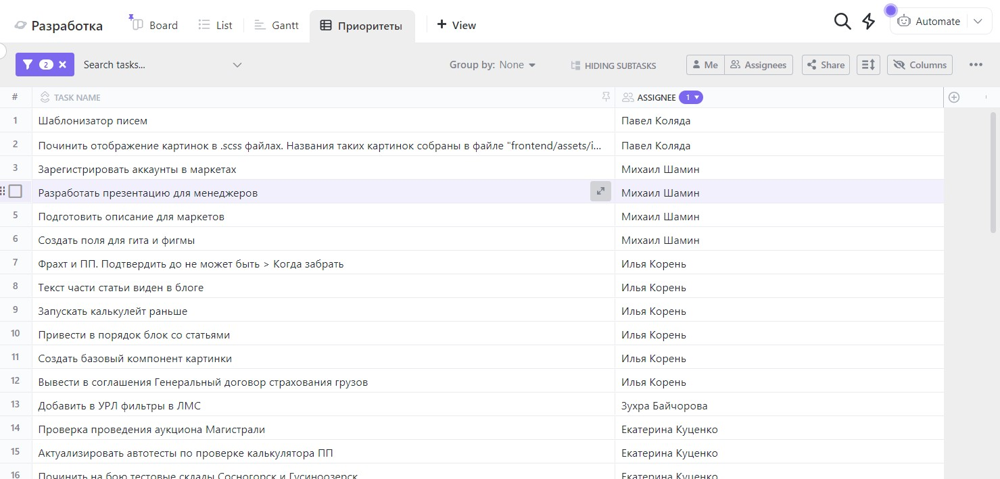

# Роадмап и приоритизация задач

Задача продакт оунера приоритизировать задачи в статусах Инициация и Анализ.

Для приоритизации следует обратится к готовым фреймворкам, напирмер: AARRR или HEART.

Если эти фремворки нам не подходят, то можно придумать свой основываясь на следующих вопросах:

- На какую метрику бизнеса влияет фича?

- Что будет считаться показателем успеха внедрения?

- Сколько людей будет этим пользоваться? Как часто?

- Поможет ли это привлечь новых пользователей?

- Станет ли пользователь счастливее?

- Создаст ли новые источники дохода?

- Если фича окажется успешной — хватит ли у нас ресурсов на ее поддержку и развитие? Производственный цикл станет сложнее, увеличится нагрузка на тех. поддержку и т. д.

- Cколько будет стоить разработка?

- Как быстро мы сможем ее сделать?

- Будет ли это важно и актуально спустя какое-то время?

Оценивать задачи предлагается по пятибалльной шкале, где:
- 1 — «точно нет», «легко», «мало», «быстро», «дешево»
- 5 — «точно да», «трудно», «много», «медленно», «дорого».

Бизнесовую часть задачи оценивает «бизнес»: генеральный директор, операционный директор, директор по маркетингу, PO, CTO, дизайнер, PM. 

Техническую часть задач оценивает «разработка»: бэкенд, фронттенд-разработчики, тестировщики.

Сбор метрик реализуется через стороннее приложение ducalis.io. В свою очередь, Дукалис интегрируется с КликАп и возвращает суммарную оценку для PO, помогая ему принимать решения.

PO актуализирует приоритеты для всех команд:
- сайт,
- мобильное приложение,
- интеграции.

Актуализация происходит в КликАпе в соответствующих пространствах. Для этого необходимо перейти в нужное пространство во вкладку Приоритеты:

И настроить фильтр таким образом, чтобы в него попадали задачи в статусах Инициация и Анализ. В каждом пространстве существует эпик «Баги», его можно не приоритизировать, так как критические дефекты должны исправляться сразу в рамках спринтов, а баги более низкого приоритета, будут распределяться в рамках спринтов, в случае низкой нагрузки.

Так же можно не приоритизировать эпик «Тесты», за него отвечает Ведущий тестировщик. 

Что задачи из этих эпиков не отображались, необходимо добавить эпики в исключения в фильтре.

В случае если у получившейся таблицы не видны колонки из Дукалиса, необходимо включить их в настройках, так же можно настроить сортировку по нужной колонке, чтобы 

Приоритизация тестов